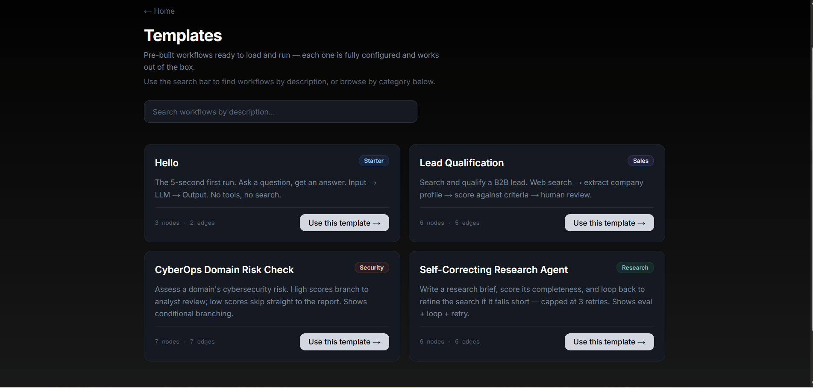
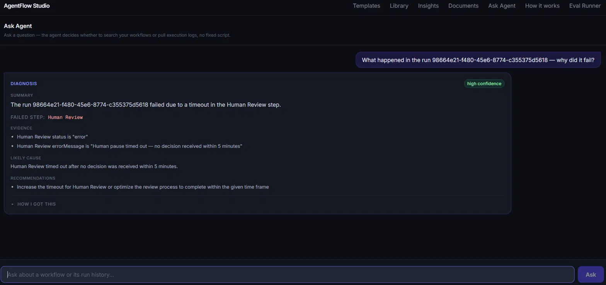

# AgentFlow Studio

AgentFlow Studio

A visual AI workflow builder with a custom execution engine, live tracing, human approval, production guardrails, and an AI debugging assistant.

Build AI agents by dragging nodes onto a canvas. Search the web, analyze results with an LLM, validate the output, pause for human approval, and watch every step execute live.

When a workflow fails, the debugging assistant investigates the actual run trace and guardrail events to explain what went wrong and recommend a fix - grounded in real execution data, not a guess.

Built from scratch with no LangChain or orchestration framework. Traced, budgeted, validated, and regression-tested on every commit.

**Live**: [agentflow-studio-six.vercel.app](https://agentflow-studio-six.vercel.app) · **Repo**: [github.com/trinayanswarup/agentflow-studio](https://github.com/trinayanswarup/agentflow-studio)

---

## See it run


_Click to play — a full workflow run: search, LLM risk analysis, scoring, human review, and approval, end to end._

---

## Screenshots


_Nodes light up in real time as the workflow executes. Each step shows latency and token count._


_Drag-and-drop canvas with 6 node types. Click any node to configure it._


_Workflows pause for human review. Approve the output, edit it, or reject and stop the run._


_Upload a PDF or Word doc, ask questions, get answers with cited source excerpts._


_Ask Agent investigates a failed run and returns a structured diagnosis - never guessing when a recorded fact is available._

---

## Ask Agent - a real debugging tool

Click "Investigate failure" on any failed run and an agent - built on the Model Context Protocol - investigates it. It's required to read the run's actual execution data before it's allowed to answer, and it prioritizes recorded facts (a logged timeout, a logged validation error) over speculation. The output is a structured diagnosis: **Summary, Evidence, Likely Cause, Confidence level, Recommendations** - never a guess dressed up as certainty.

This isn't a chatbot bolted onto the product. While building it, it surfaced and helped fix two real race-condition bugs in the execution engine itself - the tool doing its job on the app it was built for.

```
User question → Groq decides: search saved workflows, pull a run's
execution trace, pull guardrail events, or answer directly - genuine
tool-use, not a hardcoded if/else → structured, evidence-based answer
```

---

## Production engineering

**Observability (Langfuse)** - every run produces a trace: one span per node, one generation per LLM call recording model, prompt, response, tokens, and latency. No-op when unconfigured - zero overhead, zero risk.

**Guardrails** - structured LLM output validated with Zod (one retry, then a clean failure - never an unhandled crash), retries with exponential backoff on transient errors, per-run cost caps, and per-step timeouts. All recorded as trace events, all shown live in the run's trace panel.

**Eval regression suite** - 128+ unit tests and 17 eval cases, including cases that verify the guardrails themselves actually fire (not just the happy path). Mock evals run in CI on every push with zero API keys; live evals run on demand against real Groq/Tavily.

---

## What it does

| Feature                | Description                                                                                                                              |
| ---------------------- | ---------------------------------------------------------------------------------------------------------------------------------------- |
| Visual workflow editor | Drag-and-drop canvas, 6 node types, live config panel                                                                                    |
| Execution engine       | Custom graph walker - SSE streaming, Groq function-calling loop, condition branching, loop guard                                         |
| Human-in-the-loop      | Workflows pause for human approval - approve, edit output, or reject                                                                     |
| Ask Agent              | Failure-debugging assistant - MCP-based, structured diagnosis, evidence over speculation                                                 |
| Eval framework         | Deterministic assertions and optional LLM-as-judge scoring                                                                               |
| Template library       | Lead qualification, domain-risk analysis, and self-correcting research templates - demonstrating tools, conditions, approvals, and loops |
| Semantic search        | Natural language search over saved workflows via pgvector cosine similarity                                                              |
| Document Q&A           | Upload PDF or Word → chunk → embed → ask questions → cited answers                                                                       |
| PDF → workflow import  | Upload an SOP document → Groq extracts steps → workflow appears on canvas                                                                |
| Workflow Insights      | Run counts, avg latency, step failure rates across all workflows                                                                         |
| Export and share       | Download any workflow as JSON or generate a public read-only share link                                                                  |

---

## Architecture

```
Browser (React Flow canvas)
    │
    ├── save workflow ──────────────────────────────► Supabase (workflows)
    │
    └── POST /api/run
            │
            ▼
    WorkflowRunner (TypeScript)
            │  every node wrapped in: Langfuse span · cost check · step timeout
            │
            ├── llm_call ──► withRetry ──► Groq function-calling loop
            │                   │ tool_use response          │ structured output?
            │                   ▼                             ▼
            │               Tool registry              Zod validate → retry once →
            │               (web_search, web_fetch,     clean failure
            │               extract_json, send_webhook,
            │               evaluate_output)
            │                   │ Groq down
            │                   ▼
            │               Gemini 2.5 Flash fallback
            │
            ├── tool_call ─► Tool registry (direct, no LLM)
            ├── condition ─► Expression evaluator → true / false edge
            ├── human_pause → poll Supabase every 2s until approved / rejected
            └── output ────► emit run_complete
                    │
                    ▼
            SSE stream (serialized per-run persistence) → browser
                    │
                    ▼
            Supabase (runs, run_steps, human_approvals, guardrail_events, eval_runs)
                    │
                    ▼
            Langfuse (trace: spans + generations + guardrail events)

Separately - Ask Agent:
  Question → Groq decides which tool, if any → MCP-compliant tool
  executes (search_docs / get_run_details / get_guardrail_events) →
  result fed back to Groq → structured diagnosis or plain answer
```

**Why SSE over WebSockets**: unidirectional server→client is all a trace stream needs - no connection upgrade, works natively with Next.js `ReadableStream`.

**Why Groq**: free tier, fast inference, function calling support. Gemini 2.5 Flash is the fallback when Groq is unavailable.

**Why polling for human-pause**: the execution trace already uses a long-lived SSE connection. Adding a separate realtime subscription increased connection and state-management complexity, while polling every two seconds was simpler and sufficient for an interaction that takes seconds to minutes.

**Why MCP, and an honest note on the transport**: the diagnostic tools are built as genuine MCP-compliant tools - proper Zod schemas, annotations - so the same debugging capability could be reused by Claude Desktop or any other MCP client, not just this app. Because Vercel serverless functions can't hold the persistent connection MCP's standard transports assume, the tools are also exported as plain callable functions and called directly within the app today. The protocol layer is real; the live client connection is a documented tradeoff, not a gap I tried to hide.

---

## Four engineering decisions worth knowing

**Zod as single source of truth** - each tool's input schema is defined once in Zod. The JSON Schema passed to Groq for function-calling is auto-derived via `z.toJSONSchema()` - validation and the LLM tool spec can never drift apart.

**A race condition, found twice** - the SSE stream originally persisted trace events fire-and-forget. Twice during this build, that caused real bugs: once where a human-pause approval could be clicked before its own database row existed, and again where a step's completion could reach Supabase before its own start record, leaving it permanently stuck at `status: running` even after the run had finished. Both were fixed by serializing writes per-run instead of firing them independently - the second instance was actually found _by_ the Ask Agent debugging feature, while investigating a run whose data didn't add up.

**Diagnosis must prioritize recorded facts over speculation** - early versions of the failure-diagnosis assistant would sometimes give a confidently wrong answer, guessing at a cause from output shape even when a definitive, recorded guardrail event (like a timeout) was available. Fixed by giving recorded facts explicit priority over inference - a debugging tool that's confidently wrong is worse than one that admits uncertainty.

**`tool_use_failed` retry** - `openai/gpt-oss-120b` occasionally invents a fake tool name to format its final answer, which Groq rejects with a 400. The agent loop catches this and retries the same conversation without tools.

More decisions (loop guard, `AsyncLocalStorage` context propagation, Groq's JSON Schema subset limitations) documented in [`docs/ARCHITECTURE.md`](docs/ARCHITECTURE.md).

---

## Tests and CI

128+ unit tests, 17 eval regression cases. CI runs type checking, build, lint, unit tests, and mock evals on every push. Live evaluations run manually against real Groq and Tavily APIs.

---

## Tech stack

Next.js 14 · TypeScript · React Flow · Groq · Gemini · Tavily · Supabase (pgvector) · Hugging Face embeddings · Langfuse · MCP · Zod · Vitest · Vercel

---

## Built by

Trinayan - Computer Engineering, Vilnius Tech
[github.com/trinayanswarup](https://github.com/trinayanswarup)
