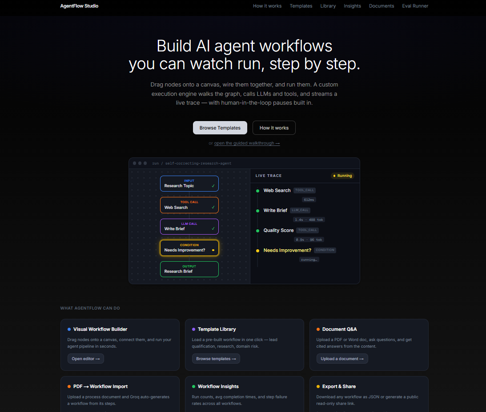

# AgentFlow Studio

A visual AI workflow builder with a custom execution engine. Drag nodes onto a canvas, connect them, and run them. The engine walks the graph, calls LLMs via Groq function-calling, invokes tools, streams live trace events over SSE, and handles human-in-the-loop review — built from scratch, no LangChain or orchestration framework.

**Live**: [agentflow-studio-six.vercel.app](https://agentflow-studio-six.vercel.app) · **Repo**: [github.com/trinayanswarup/agentflow-studio](https://github.com/trinayanswarup/agentflow-studio)

---

## Screenshots


_Homepage_


_Nodes light up in real time as the workflow executes. Each step shows latency and token count._


_Drag-and-drop canvas with 6 node types. Click any node to configure it._


_Workflows pause for human review. Approve the output, edit it, or reject and stop the run._


_Upload a PDF or Word doc, ask questions, get answers with cited source excerpts._

---

## What it does

| Feature                | Description                                                                                            |
| ---------------------- | ------------------------------------------------------------------------------------------------------ |
| Visual workflow editor | Drag-and-drop canvas, 6 node types, live config panel, slug-based variable references                  |
| Execution engine       | Custom graph walker — SSE streaming, Groq function-calling loop, condition branching, loop guard       |
| Human-in-the-loop      | Workflows pause for human approval — approve, edit output, or reject before continuing                 |
| Eval framework         | Run test cases with exact match, contains, or LLM-as-judge scoring. Scores persisted to Supabase       |
| Template library       | 4 pre-built workflows: Hello, Lead Qualification, CyberOps Domain Risk, Self-Correcting Research Agent |
| Semantic search        | Natural language search over saved workflows via pgvector cosine similarity                            |
| Document Q&A           | Upload PDF or Word → chunk → embed → ask questions → cited answers from source chunks                  |
| PDF → workflow import  | Upload an SOP document → Groq extracts steps → workflow appears on canvas ready to edit                |
| Workflow Insights      | Run counts, avg latency, step failure rates across all workflows                                       |
| Export and share       | Download any workflow as JSON or generate a public read-only share link                                |

---

## Architecture

```
Browser (React Flow canvas)
    │
    ├── save workflow ──────────────────────────────► Supabase (workflows)
    │
    └── POST /api/run
            │
            ▼
    WorkflowRunner (TypeScript — lib/engine/runner.ts)
            │
            ├── llm_call ──► Groq function-calling loop
            │                   │ tool_use response
            │                   ▼
            │               Tool registry (web_search, web_fetch,
            │               extract_json, send_webhook, evaluate_output)
            │                   │ Groq down
            │                   ▼
            │               Gemini 2.5 Flash fallback
            │
            ├── tool_call ─► Tool registry (direct, no LLM)
            │
            ├── condition ─► Expression evaluator → true / false edge
            │
            ├── human_pause → write waiting row to Supabase
            │                  poll every 2s until approved / rejected
            │
            └── output ────► emit run_complete
                    │
                    ▼
            SSE stream → browser (nodes highlight in real time)
                    │
                    ▼
            Supabase (runs, run_steps, human_approvals, workflow_runs)
```

**Why SSE over WebSockets**: SSE is unidirectional server→client, which is all a trace stream needs. No connection upgrade, works natively in Next.js App Router with `ReadableStream`, simpler failure model.

**Why Groq**: Free tier, fast inference, `llama-3.3-70b-versatile` supports function calling. Gemini 2.5 Flash handles long-context fallback when Groq is unavailable or rate-limited.

**Why polling for human-pause**: Supabase Realtime requires a persistent connection that conflicts with the SSE stream. Polling every 2s is simpler, predictable, and sufficient — a human takes seconds to minutes to respond.

---

## Engineering details

**Zod as single source of truth**

Each tool's input schema is defined once in Zod. The JSON Schema passed to Groq for function-calling is auto-derived via `z.toJSONSchema()`. Validation and the LLM tool spec can never drift apart — there is only one definition.

**`tool_use_failed` retry**

`llama-3.3-70b-versatile` occasionally invents a fake tool name to format its final answer, which Groq rejects with a 400. The agent loop catches this specific error and retries the same conversation without tools, forcing a plain text response. This is a known llama quirk.

**Human-pause race condition**

The SSE stream persists steps fire-and-forget. If the user clicks Approve before the async `run_steps` write lands, the approve API finds no `waiting` row and returns a 409. Fixed by having the human-pause node own its own Supabase write synchronously before polling starts — the row is guaranteed to exist before the SSE event reaches the client.

**Loop guard**

A condition node whose branch points back upstream creates a loop. The runner tracks visit counts per node and enforces a hard cap of 3 iterations, emitting a `loop_limit` trace event and continuing forward on overflow. No new node type needed.

**Slug system**

Node outputs are referenceable as `{{node_label_output}}` (readable) or `{{nodeId_output}}` (UUID). Both resolve simultaneously so old saved workflows with UUID references continue to work after the slug system is introduced.

---

## Failure modes

| Failure                | Behavior                                                                |
| ---------------------- | ----------------------------------------------------------------------- |
| Groq unavailable       | Falls back to Gemini 2.5 Flash automatically                            |
| Tavily rate-limited    | Tool returns error, step marked failed, trace shows reason              |
| Tab closed mid-run     | SSE drops, run continues server-side, state persisted in Supabase       |
| Tool input invalid     | Zod catches it, returns plain-English error naming the missing argument |
| Loop runs forever      | Visit counter hits 3, emits `loop_limit`, takes forward path            |
| LLM invents fake tool  | Caught by `tool_use_failed` handler, retried without tools              |
| PDF import unparseable | Groq response validated with Zod, friendly error returned, no crash     |

---

## Templates

**Hello** — `input → llm_call → output`. Runs in ~2s. No tools. First-run starter.

**Lead Qualification** — `input → web_search → llm_call (extract profile) → tool_call (evaluate_output) → human_pause → output`. Searches a company, extracts a profile, scores fit 1–10, pauses for human review before finalising.

**CyberOps Domain Risk Check** — `input → web_search → llm_call (extract risk signals as JSON) → tool_call (evaluate_output, risk score) → condition (score ≥ 7?) → human_pause (high risk) or output (low risk)`. Shows conditional branching — high-risk domains get analyst review, low-risk ones pass through.

**Self-Correcting Research Agent** — `input → web_search → llm_call (write brief) → tool_call (evaluate_output, quality score) → condition (score < 7?) → loop back to web_search (low quality) or output (good)`. The agent scores its own output and retries if quality is insufficient. Loop guard caps at 3 retries.

---

## How to add a tool

```typescript
// lib/tools/my-tool.ts
import { z } from "zod";
import { defineTool } from "./registry";

export const myTool = defineTool({
  name: "my_tool",
  description: "What this tool does",
  inputSchema: z.object({
    query: z.string().describe("The input query"),
  }),
  execute: async (input) => {
    // input is fully typed and Zod-validated before execute() is called
    return `result for ${input.query}`;
  },
});
```

Then register it in `lib/tools/registry.ts`:

```typescript
registry.set("my_tool", myTool);
```

The JSON Schema for Groq function-calling is auto-derived from `inputSchema` — nothing else to update.

---

## How to add a node type

1. Add the discriminated union variant to `lib/types.ts`
2. Create `lib/engine/nodes/my-node.ts` with `execute(node, context, runId?)`
3. Add `case 'my_node':` to the switch in `lib/engine/runner.ts`
4. Create `components/canvas/nodes/MyNode.tsx` for the React Flow visual

---

## Local setup

**Prerequisites**: Node 20+, Supabase project with pgvector enabled

```bash
git clone https://github.com/trinayanswarup/agentflow-studio
cd agentflow-studio
npm install
cp .env.example .env.local
# fill in all values
npm run dev
```

**.env.local**:

```
GROQ_API_KEY=
GEMINI_API_KEY=
TAVILY_API_KEY=
HUGGINGFACE_API_KEY=
NEXT_PUBLIC_SUPABASE_URL=
NEXT_PUBLIC_SUPABASE_ANON_KEY=
SUPABASE_SERVICE_ROLE_KEY=
NEXT_PUBLIC_BASE_URL=
```

**Supabase migrations**: Enable pgvector first, then run the SQL in `PRD.md` → Phase 3 section.

```bash
npm test        # 50+ tests, all offline
npm run build   # must pass clean
```

---

## Tests

50+ Vitest tests covering the execution engine (graph walking, condition branching, loop guard, template resolution), tool inputs (validation, friendly errors), API routes (Zod validation, error handling), template registry structure, eval scoring strategies, RAG chunking and embeddings, and document parsing. All tests are offline — no real API calls to Groq, Tavily, Supabase, or Hugging Face.

---

## Development notes

Detailed planning docs (CLAUDE.md, PRD.md, AGENTS.md) are kept private. They contain AI coding instructions, internal build quirks, and session-specific workflow notes used during active development with Claude Code.
Public versions are committed for reference.

## Built by

Trinayan — Computer Engineering, Vilnius Tech  
[github.com/trinayanswarup](https://github.com/trinayanswarup)
