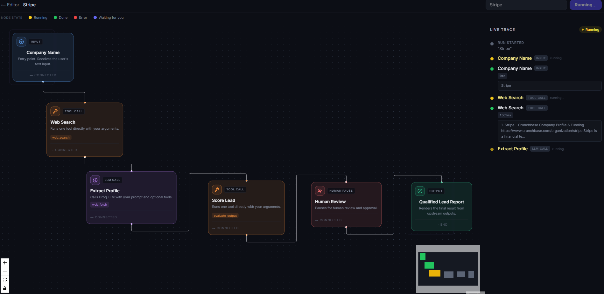
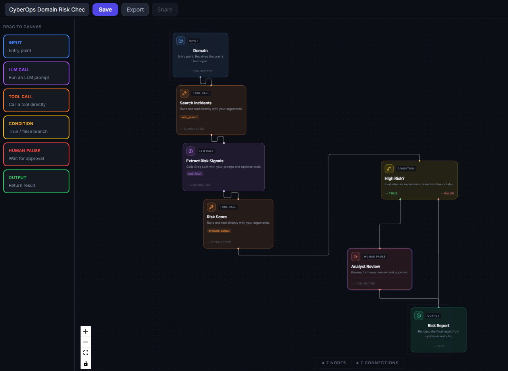
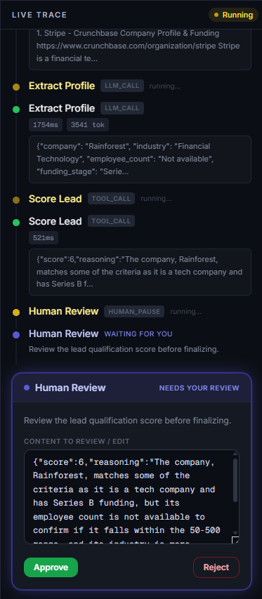
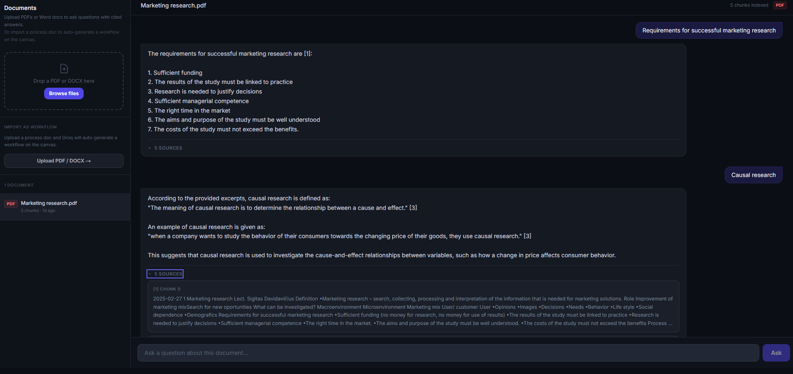

# AgentFlow Studio

A visual AI workflow builder with a custom execution engine — traced, budgeted, validated, and regression-tested on every commit. Drag nodes onto a canvas, connect them, and run them. Built from scratch, no LangChain or orchestration framework.

**Live**: [agentflow-studio-six.vercel.app](https://agentflow-studio-six.vercel.app) · **Repo**: [github.com/trinayanswarup/agentflow-studio](https://github.com/trinayanswarup/agentflow-studio)

---

## Screenshots


*Nodes light up in real time as the workflow executes. Each step shows latency and token count.*


*Drag-and-drop canvas with 6 node types. Click any node to configure it.*


*Workflows pause for human review. Approve the output, edit it, or reject and stop the run.*


*Upload a PDF or Word doc, ask questions, get answers with cited source excerpts.*

---

## Production hardening

The execution engine isn't just functional — it's instrumented, protected, and regression-tested the way a real production system would be.

**Observability (Langfuse)**
Every workflow run produces a trace: one span per node, one generation observation per LLM call recording model, prompt, response, token usage, and latency. Tracing is a no-op when unconfigured — zero overhead, zero risk to the app if Langfuse is down or unset.

**Guardrails on every LLM call**
- **Structured output validation** — LLM responses expected to be JSON are parsed through Zod. On failure, one retry with the validation error fed back into the prompt; on second failure, a clean `OUTPUT_VALIDATION_FAILED` surfaced in the UI, never an unhandled crash.
- **Retry with backoff** — transient errors (429, 5xx, network, timeout) get up to 3 retries with exponential backoff and jitter. Validation failures and 4xx errors are never blindly retried.
- **Cost caps and timeouts** — each run tracks estimated cost from token usage; exceeding a configurable cap aborts the run with `BUDGET_EXCEEDED`. Each step has an `AbortController` timeout so one hung call can't freeze a workflow forever.

All guardrail events are recorded on the Langfuse trace and shown live in the run's trace panel.

**Eval regression suite**
17 golden test cases covering condition boundaries, loop behavior, and the guardrails themselves — including dedicated cases that verify `BUDGET_EXCEEDED` and `STEP_TIMEOUT` actually fire correctly. Mock cases (zero API keys required) run on every push in CI; live cases run on demand against real Groq/Tavily. Results are logged to Supabase so pass-rate is tracked over time, not just checked once.

```
npm run evals:mock   → 13/13, no API keys needed, runs in CI on every push
npm run evals:live   → runs against real Groq/Tavily, manually triggered
```

---

## What it does

| Feature | Description |
|---|---|
| Visual workflow editor | Drag-and-drop canvas, 6 node types, live config panel, slug-based variable references |
| Execution engine | Custom graph walker — SSE streaming, Groq function-calling loop, condition branching, loop guard |
| Human-in-the-loop | Workflows pause for human approval — approve, edit output, or reject before continuing |
| Eval framework | Run test cases with exact match, contains, or LLM-as-judge scoring. Scores persisted to Supabase |
| Template library | 4 pre-built workflows: Hello, Lead Qualification, CyberOps Domain Risk, Self-Correcting Research Agent |
| Semantic search | Natural language search over saved workflows via pgvector cosine similarity |
| Document Q&A | Upload PDF or Word → chunk → embed → ask questions → cited answers from source chunks |
| PDF → workflow import | Upload an SOP document → Groq extracts steps → workflow appears on canvas ready to edit |
| Workflow Insights | Run counts, avg latency, step failure rates across all workflows |
| Export and share | Download any workflow as JSON or generate a public read-only share link |

---

## Architecture

```
Browser (React Flow canvas)
    │
    ├── save workflow ──────────────────────────────► Supabase (workflows)
    │
    └── POST /api/run
            │
            ▼
    WorkflowRunner (TypeScript — lib/engine/runner.ts)
            │  every node wrapped in: Langfuse span · cost check · step timeout
            │
            ├── llm_call ──► withRetry ──► Groq function-calling loop
            │                   │ tool_use response          │ structured output?
            │                   ▼                             ▼
            │               Tool registry              Zod validate → retry once → 
            │               (web_search, web_fetch,     OUTPUT_VALIDATION_FAILED
            │               extract_json, send_webhook,
            │               evaluate_output)
            │                   │ Groq down
            │                   ▼
            │               Gemini 2.5 Flash fallback
            │
            ├── tool_call ─► Tool registry (direct, no LLM)
            │
            ├── condition ─► Expression evaluator → true / false edge
            │
            ├── human_pause → write waiting row to Supabase
            │                  poll every 2s until approved / rejected
            │
            └── output ────► emit run_complete
                    │
                    ▼
            SSE stream → browser (nodes highlight in real time)
                    │
                    ▼
            Supabase (runs, run_steps, human_approvals, workflow_runs, eval_runs)
                    │
                    ▼
            Langfuse (trace: spans + generations + guardrail events)
```

**Why SSE over WebSockets**: SSE is unidirectional server→client, which is all a trace stream needs. No connection upgrade, works natively in Next.js App Router with `ReadableStream`, simpler failure model.

**Why Groq**: Free tier, fast inference, `llama-3.3-70b-versatile` supports function calling. Gemini 2.5 Flash handles long-context fallback when Groq is unavailable or rate-limited.

**Why polling for human-pause**: Supabase Realtime requires a persistent connection that conflicts with the SSE stream. Polling every 2s is simpler, predictable, and sufficient — a human takes seconds to minutes to respond.

**Why mock/live split for evals**: mock cases run in CI on every push with zero API cost and zero flakiness — they catch real regressions in engine logic and guardrails. Live cases isolate genuine model/search variance from harness bugs, and only run on demand so CI never burns API quota or fails on noise it can't control.

---

## Engineering details

**Zod as single source of truth**

Each tool's input schema is defined once in Zod. The JSON Schema passed to Groq for function-calling is auto-derived via `z.toJSONSchema()`. Validation and the LLM tool spec can never drift apart.

**`tool_use_failed` retry**

`llama-3.3-70b-versatile` occasionally invents a fake tool name to format its final answer, which Groq rejects with a 400. The agent loop catches this specific error and retries the same conversation without tools. Known llama quirk.

**Human-pause race condition**

The SSE stream persists steps fire-and-forget. If the user clicks Approve before the async `run_steps` write lands, the approve API finds no `waiting` row and returns a 409. Fixed by having the human-pause node own its own Supabase write synchronously before polling starts.

**Loop guard**

A condition node whose branch points back upstream creates a loop. The runner tracks visit counts per node and enforces a hard cap of 3 iterations, emitting a `loop_limit` event and continuing forward on overflow.

**Slug system**

Node outputs are referenceable as `{{node_label_output}}` (readable) or `{{nodeId_output}}` (UUID). Both resolve simultaneously so old saved workflows with UUID references keep working.

**Guardrails don't change the happy path**

Structured validation, retry, cost tracking, and timeouts are threaded through via `AsyncLocalStorage` (ambient context) rather than new parameters on every function signature — kept the blast radius small and meant zero changes to the `Tool` interface or any existing tool file. A workflow with no issues runs identically, byte-for-byte, to before these guardrails existed.

---

## Failure modes

| Failure | Behavior |
|---|---|
| Groq unavailable | Falls back to Gemini 2.5 Flash automatically |
| Tavily rate-limited | Retried with backoff; if still failing, step marked failed with reason shown in trace |
| Tab closed mid-run | SSE drops, run continues server-side, state persisted in Supabase |
| Tool input invalid | Zod catches it, returns plain-English error naming the missing argument |
| LLM output fails schema | One retry with the validation error in-prompt; second failure → `OUTPUT_VALIDATION_FAILED` |
| Run exceeds cost cap | Aborts cleanly with `BUDGET_EXCEEDED`, recorded on the trace |
| Step hangs | `AbortController` timeout fails the step instead of freezing the run |
| Loop runs forever | Visit counter hits 3, emits `loop_limit`, takes forward path |
| LLM invents fake tool | Caught by `tool_use_failed` handler, retried without tools |
| PDF import unparseable | Groq response validated with Zod, friendly error returned, no crash |

---

## Templates

**Hello** — `input → llm_call → output`. Runs in ~2s. No tools. First-run starter.

**Lead Qualification** — `input → web_search → llm_call (extract profile) → tool_call (evaluate_output) → human_pause → output`. Searches a company, extracts a profile, scores fit 1–10, pauses for human review.

**CyberOps Domain Risk Check** — `input → web_search → llm_call (extract risk signals) → tool_call (evaluate_output) → condition (score ≥ 7?) → human_pause (high risk) or output (low risk)`. Conditional branching — high-risk domains get analyst review, low-risk ones pass through.

**Self-Correcting Research Agent** — `input → web_search → llm_call (write brief) → tool_call (evaluate_output) → condition (score < 7?) → loop back to web_search or output`. The agent scores its own output and retries if quality is insufficient. Loop guard caps at 3 retries.

---

## How to add a tool

```typescript
// lib/tools/my-tool.ts
import { z } from 'zod'
import { defineTool } from './registry'

export const myTool = defineTool({
  name: 'my_tool',
  description: 'What this tool does',
  inputSchema: z.object({
    query: z.string().describe('The input query'),
  }),
  execute: async (input) => {
    return `result for ${input.query}`
  },
})
```

Register it in `lib/tools/registry.ts`:
```typescript
registry.set('my_tool', myTool)
```

JSON Schema for Groq function-calling is auto-derived from `inputSchema` — nothing else to update.

## How to add a node type

1. Add the discriminated union variant to `lib/types.ts`
2. Create `lib/engine/nodes/my-node.ts` with `execute(node, context, runId?)`
3. Add `case 'my_node':` to the switch in `lib/engine/runner.ts`
4. Create `components/canvas/nodes/MyNode.tsx` for the React Flow visual

## How to add an eval case

Add a JSON file to `evals/cases/` with `{ id, description, tags, template, input, assertions }`. Tag it `mock` (runs in CI, zero API keys) or `live` (real API calls, manual trigger only). Full assertion types documented in `evals/README.md`.

---

## Local setup

**Prerequisites**: Node 20+, Supabase project with pgvector enabled

```bash
git clone https://github.com/trinayanswarup/agentflow-studio
cd agentflow-studio
npm install
cp .env.example .env.local
# fill in all values
npm run dev
```

**.env.local**:
```
GROQ_API_KEY=              # groq.com — free
GEMINI_API_KEY=            # aistudio.google.com — free
TAVILY_API_KEY=            # tavily.com — free, 1000 req/month
HUGGINGFACE_API_KEY=       # huggingface.co — free
NEXT_PUBLIC_SUPABASE_URL=  # bare project URL — no /rest/v1/ suffix
NEXT_PUBLIC_SUPABASE_ANON_KEY=
SUPABASE_SERVICE_ROLE_KEY= # server-side only, never expose client-side
NEXT_PUBLIC_BASE_URL=      # http://localhost:3000 locally
LANGFUSE_SECRET_KEY=       # cloud.langfuse.com — free, optional (no-op if unset)
LANGFUSE_PUBLIC_KEY=       # optional
LANGFUSE_BASEURL=          # defaults to https://cloud.langfuse.com
WORKFLOW_COST_CAP_USD=     # optional, defaults to 0.10
WORKFLOW_STEP_TIMEOUT_MS=  # optional, defaults to 30000
```

**Supabase migrations**: Enable pgvector first, then run the SQL migrations in `PRD.md` → Phase 3, and `evals/eval_runs.sql`.

```bash
npm run build         # must pass clean
npm test               # 89 tests, all offline
npm run evals:mock    # 13 eval cases, zero API keys needed
```

---

## Tests

89 Vitest unit tests plus 17 eval regression cases. Coverage spans the execution engine (graph walking, condition branching, loop guard, template resolution), guardrails (retry backoff, structured output validation, cost cap, step timeout), tool inputs, API routes, template registry, RAG chunking and embeddings, and document parsing. All unit tests and mock evals are offline — zero real API calls, zero API keys required to run them.

CI runs type check, build, lint, unit tests, and mock evals on every push. A separate manually-triggered workflow runs the live eval suite against real Groq/Tavily.

---

## Built by

Trinayan — Computer Engineering, Vilnius Tech
[github.com/trinayanswarup](https://github.com/trinayanswarup)